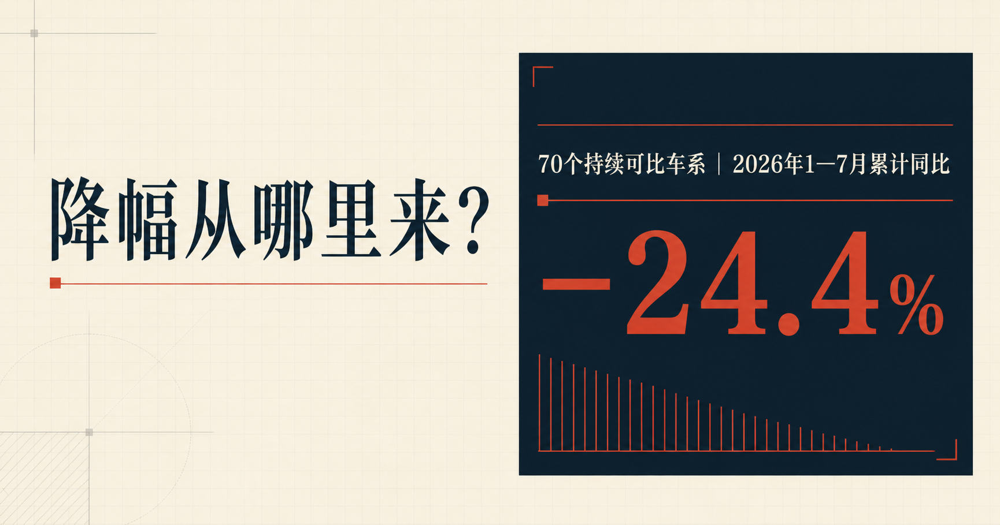

# 降幅从哪里来？中国乘用车样本分析



[查看在线项目](https://liushizhong201-code.github.io/china-auto-insight/)

这是一个面向车企市场分析、经营分析和产品规划岗位的求职作品集项目。项目从公开数据源验证开始，完成样本口径设计、数据质量检查、实体匹配、结构分析和网页发布，回答70个持续可比车系的销量变化主要落在哪些指导价区间、能源类型和车型级别。

## 业务问题

2026年1—7月与2025年同期相比，样本车系的销量变化流向了哪里？

分析拆成三个维度：

- 指导价：分别按价格区间下限、中点和上限归类，检查结论是否稳定
- 能源：燃油、油混、插混、增程、纯电
- 级别：轿车、SUV和MPV的12个细分类别

页面同时保留70个车系的累计销量和增减排名，便于从结构结论回到具体车系。

## 样本与口径

| 项目 | 口径 |
|---|---|
| 国家与行业 | 中国乘用车 |
| 分析窗口 | 2026年1—7月累计对比2025年1—7月累计 |
| 母样本 | AutoLink 2026年7月公开零售榜前100车系 |
| 正式面板 | 两年14个月销量均完整的70个车系，共980个车系月 |
| 车系市场数据 | AutoLink公开页面，页面标注数据来源易车 |
| 官方总量对账 | 乘联分会中国狭义乘用车国内零售累计总量 |
| 价格字段 | 平台展示指导价区间，不与经销商报价或成交价混用 |

30个历史月份不完整的车系被排除并保留审计记录，缺失值没有填零。正式分析只描述这70个持续可比车系，不能外推为中国乘用车全市场。

## 核心发现

- 70车系2025年1—7月累计销量为624.72万辆，2026年同期为472.26万辆，减少152.46万辆，同比下降24.4%
- 燃油车系减少61.03万辆，是能源结构中最大的绝对降幅来源
- 大型SUV增加4.82万辆、小型SUV增加2.05万辆，是车型级别中少数增长区域
- 价格带结论对归类规则敏感。按指导价下限、中点和上限计算时，最大降幅分别落在不同区间，因此页面不输出单一价格带结论

## 数据质量

- 固定流程连续运行3次，每轮201个请求全部成功，无登录、验证码或人工干预
- 70个正式车系的成员和业务指纹在3轮运行中一致
- 正式面板10个核心字段完整率均为100%，稳定车系ID连接率为100%
- AutoLink公开总量相对乘联分会狭义零售累计总量，2025年高0.70%，2026年高1.23%。两者趋势量级接近，但统计口径不完全相同，因此不相加、不调平

## 看板内容

- 第一屏：研究范围、累计销量和三条结论
- 交互分析：七个月样本走势、能源结构、车型级别、指导价敏感性、能源×级别矩阵
- 车系贡献：70车系搜索、筛选、排序和累计详情
- 方法与复盘：样本流程、质量闸门、官方总量对账、来源和使用边界

页面采用原生HTML、CSS和JavaScript开发，不依赖外部字体、图表库或运行时网络请求。桌面1440×1000和手机390×844视口均通过回归，页面级横向溢出、控制台错误和页面错误为0。

## 使用边界

公开仓库只保留累计分析层，不包含以下内容：

- 70车系×14个月的逐月面板
- 原始CSV、采集响应和接口请求参数
- 平台车系ID、来源端点和内容指纹
- 批量获取脚本、平台图片、Logo和界面资源

公开数据来自可正常访问的网页，但公开访问不等于取得原始明细再分发授权。项目仅用于个人求职作品集展示。

## 来源

- [AutoLink](https://autolink.sae-china.org/)：车系销量与当前属性，页面标注数据来源易车
- [乘联分会公开统计站](https://data.cpcadata.com/)：中国狭义乘用车国内零售累计总量对账
- [易车法律声明](https://corp.yiche.com/legal-notices/)：公开展示与内容使用边界核对

## 本地预览

直接打开`index.html`，或在仓库根目录启动静态文件服务器：

```powershell
python -m http.server 8000
```

浏览器访问`http://127.0.0.1:8000/`。

## 发布文件

仓库只提交`index.html`、`styles.css`、`app.js`、`public-data.js`、`og.png`、`.nojekyll`、`README.md`和`.gitignore`。本地验证清单、验收JSON和截图由`.gitignore`排除。
